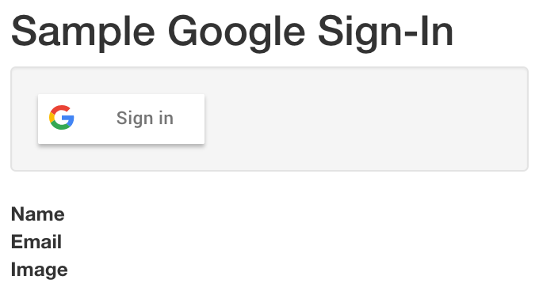
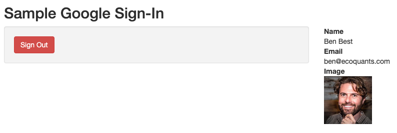
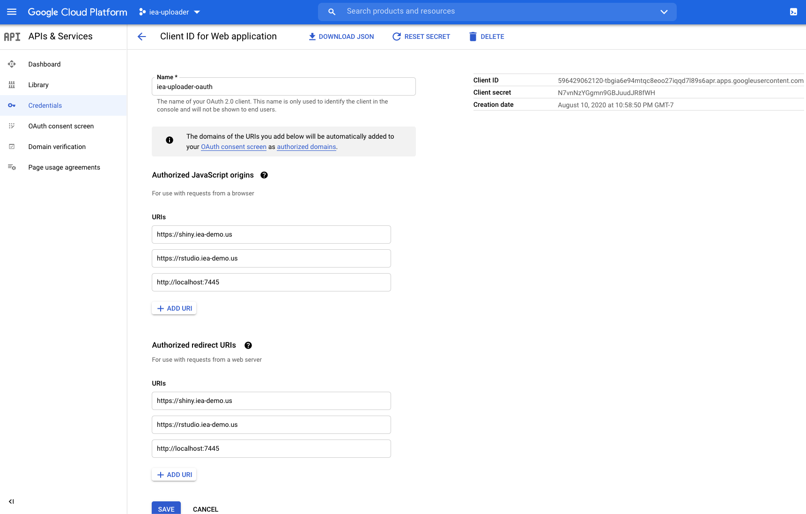

# (APPENDIX) Appendix {-} 

# Shiny: Google Authentication


## Quick Sign-In (`Google-Sign-In`)

* [dkulp2/Google-Sign-In: Simple Example of Shiny App Using Google Sign-In API](https://github.com/dkulp2/Google-Sign-In)

Presuming you have the shiny package installed (if not: `install.packages(c("shiny","shinyjs"))`), run this app like so from the Console in RStudio:

```r
shiny::runGitHub("dkulp2/Google-Sign-In", port=7445)
```

This will download and run the Shiny app:

  

Now visit the app at http://127.0.0.1:7445 and change the URL to http://localhost:7445.

Clicking the **Sign in** button pops up a window with the ability to choose an existing logged in account or **Use another account**:

  

Once signed in, then it will display the logged in account:

  

### Errors

- You'll need to change from http://127.0.0.1:7445/ to http://localhost:7445, otherwise you'll get:

  ```
  Authorization Error
  Error 400: invalid_request
  Permission denied to generate login hint for target domain.
  ```

- You'll need to run the app on a specific port using `shiny::runApp(port=7445)`, otherwise you'll get something like:

  ```
  Authorization Error
  Error 400: redirect_uri_mismatch
  The JavaScript origin in the request, http://localhost:5779, does not match the ones authorized for the OAuth client. Visit https://console.developers.google.com/apis/credentials/oauthclient/${your_client_id}?project=${your_project_number} to update the authorized JavaScript origins.
  ```
  
## Setting up for Server

So far the above app only works on "localhost", ie your machine, not on a publicly available server. In order to make that available, you need to visit the Google Cloud console, in its APIs & services > Credentials section (https://console.cloud.google.com/apis/credentials).

Unfortunately my benjamin.best@noaa.gov account did not have an existing Project nor permissions to create one, which is necessary to setup the credentials. So I used my ben@ecoquants.com account under a new project "iea-uploader":


Here are the specifics of the **iea-uploader-oauth**:



## Complex Sign-In (`googleAuthR`)

* [Authentication within Shiny -- Google authentication types for R • googleAuthR](https://code.markedmondson.me/googleAuthR/articles/google-authentication-types.html#authentication-within-shiny)


