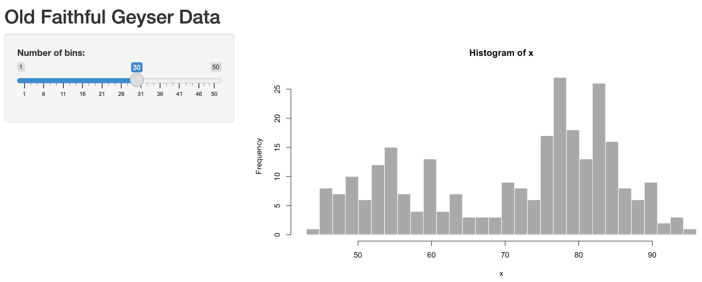

```{r, include=FALSE}
knitr::opts_chunk$set(echo = T, warning = F, message = F)

if (!require(librarian)){
  install.packages("librarian")
  library(librarian)
}
shelf(
  htmltools, mitchelloharawild/icons)
```

# Applications

## Learning Objectives {.unnumbered .objectives}

Use the Shiny framework to develop online interactive applications accepting user input to render outputs from arbitrary R functions. Server requirements differentiating from simpler Rmarkdown renderings will be reviewed as well as use of Crosstalk to gain similar functionality with Rmarkdown with simple data.

## Install `shiny` R package

Ensure you have the `shiny` R package installed. Look in RStudio's Packages pane and Install if not found when searching for "shiny".

A few other packages will get used so let's use the librarian::shelf() command to install if needed:

```{r}
librarian::shelf(
  plotly, reactlog, shiny, shinydashboard)

```

## Create your first Shiny web app

Similar to other examples, let's create a simple Shiny app starting from the provided default by going to **File** -\> **New File** -\> **Shiny Web App**... and name it ***app-faithful*** (after [faithful](https://www.rdocumentation.org/packages/datasets/versions/3.6.2/topics/faithful), the Old Faithful geyser eruption frequency dataset used in this default example):

{width="400"}

For now, let's go with the default **Single File** option that puts the entire application in `app.R` rather than splitting it in two (`ui.R`/`server.R`). You should see the following contents in the new `app.R` file contents:

``` {.r}
#
# This is a Shiny web application. You can run the application by clicking
# the 'Run App' button above.
#
# Find out more about building applications with Shiny here:
#
#    http://shiny.rstudio.com/
#

library(shiny)

# Define UI for application that draws a histogram
ui <- fluidPage(

    # Application title
    titlePanel("Old Faithful Geyser Data"),

    # Sidebar with a slider input for number of bins 
    sidebarLayout(
        sidebarPanel(
            sliderInput("bins",
                        "Number of bins:",
                        min = 1,
                        max = 50,
                        value = 30)
        ),

        # Show a plot of the generated distribution
        mainPanel(
           plotOutput("distPlot")
        )
    )
)

# Define server logic required to draw a histogram
server <- function(input, output) {

    output$distPlot <- renderPlot({
        # generate bins based on input$bins from ui.R
        x    <- faithful[, 2]
        bins <- seq(min(x), max(x), length.out = input$bins + 1)

        # draw the histogram with the specified number of bins
        hist(x, breaks = bins, col = 'darkgray', border = 'white')
    })
}

# Run the application 
shinyApp(ui = ui, server = server)
```

Let's next **Run App**. Note that you can change the options by clicking on the down triangle next to the button, such as running the app in your default web browser (***Run External***), a pop-up window or in RStudio's Viewer Pane.

{width="200"}

Now you can change the values in the slider on the left, then see the plot updated:

{width="600"}

In Shiny parlance, the histogram plot is ***reactive*** to the slider. Normally when creating web apps, this type of "reactivity" is quite complicated to code, but here by simply using `input$bins` in the plotting function for the `output$distPlot`, Shiny registers that this plot needs to be updated when the user changes the `input$bins` value.

### Run in showcase mode

This default example along with other are made available in the shiny package's installed folder:

```{r}
# get path to "examples" under your installation of the Shiny R package
dir_examples  <- system.file("examples", package="shiny")

# get all directories listed there
dirs_examples <- list.dirs(dir_examples, recursive = F)

# show the folder name only, not the rest of the path preceding (ie dirname())
basename(dirs_examples)
```

Another way to launch the shiny app is with the following:

```{r, eval=F}
# set directory to 01_hello app, aka the simplest default faithful app
dir_hello_app <- file.path(dir_examples, "01_hello")

# run the app with display.mode = "auto"
#   which under shiny R package uses "showcase" mode because of the DESCRIPTION  file there (see ?shiny::runApp)
shiny::runApp(dir_hello_app)
```

## Download & run examples

Next, let's go through examples together.

Download [shiny-intro-master.zip](https://github.com/bbest/shiny-intro/archive/master.zip) into your `r3-exercises/`, unzip it and rename the top-level folder to `apps/` so you can see the following application folders directly under `r3-exercises/apps/`:

-   `01_faithful`: default app from using RStudio, File \> New File \> Shiny Web App... 
-   `02_quakes_mag`: swap to quakes dataset, adjust histogram by magnitude
-   `03_quakes_depth`: add depth slider, select box for variable to histogram
-   `04_quakes_map`: add leaflet map
-   `05_quakes_dashboard`: enhance user interface (ie "ui") with `shinydashboard` 

Numbered folders in this repository correspond with iterative development and enhancement of a Shiny app.

The following sections in this Rmarkdown document demonstrate how you can develop output visualizations for use in a Shiny app, especially by defining input variables as a list (`input$*`).

Knitting Rmarkdown documents and pushing to Github then allows the HTML to be viewable (using the [Github Pages](https://pages.github.com) feature). In contrast, Github and most web hosting services can ***not*** host a Shiny app. Although the [leaflet](http://rstudio.github.io/leaflet) and [plotly](https://plot.ly/ggplot2) visualizations in this document are interactive in the web browser, they do not require the Shiny library or a Shiny server to be displayed. Rather, the HTML output can be easily hosted on the most basic web server or passed as an email attachment. The Shiny context allows for ultimate flexibility with user interactions, but may be overkill for basic visualization. Check out all the amazing [htmlwidgets.org](http://www.htmlwidgets.org/) and framework that works in the three contexts of: 1) RStudio, 2) Rmarkdown, and 3) Shiny.

### `01_faithful`

-   Code: [01_faithful](https://github.com/bbest/shiny-intro/tree/master/01_faithful)

-   Run from GitHub:

    ``` {.r}
    shiny::runGitHub("bbest/shiny-intro", subdir="01_faithful")
    ```

-   Run locally:

    ``` {.r}
    shiny::runApp("01_faithful")
    ```

In order to quickly experiment with visualization, we could pull the code from within the rendering function of the Shiny app and set the input list values that would otherwise be set from the user interface...

```{r}
input = list(bins = 30)

x <- faithful[, 2] 
bins <- seq(min(x), max(x), length.out = input$bins + 1)
    
hist(x, breaks = bins, col = 'darkgray', border = 'white')
```

### `02_quakes_mag`

```{r}
library(tidyverse)

input <- list(slider_mag = c(4, 6))

d <- quakes %>%
  filter(
    mag >= input$slider_mag[1],
    mag <= input$slider_mag[2])

hist(d$mag, col = 'darkgray', border = 'white')
```

-   Code: [02_quakes_mag](https://github.com/bbest/shiny-intro/tree/master/02_quakes_mag)

-   Run from GitHub:

    ``` {.r}
    shiny::runGitHub("bbest/shiny-intro", subdir="02_quakes_mag")
    ```

-   Run locally:

    ``` {.r}
    shiny::runApp("02_quakes_mag")
    ```

### `03_quakes_depth`

```{r}
library(tidyverse)

input <- list(
  select_var = "depth", 
  slider_mag = c(4, 5), 
  slider_depth = c(0, 100))

d <- quakes %>%
  filter(
    mag   >= input$slider_mag[1],
    mag   <= input$slider_mag[2],
    depth >= input$slider_depth[1],
    depth <= input$slider_depth[2])

hist(d[,input$select_var], col = 'darkgray', border = 'white')
```

-   Code: [03_quakes_depth](https://github.com/bbest/shiny-intro/tree/master/03_quakes_depth)

-   Run from GitHub:

    ``` {.r}
    shiny::runGitHub("bbest/shiny-intro", subdir="03_quakes_depth")
    ```

-   Run locally:

    ``` {.r}
    shiny::runApp("03_quakes_depth")
    ```

-   [shiny-intro/04_quakes_map at master · bbest/shiny-intro](https://github.com/bbest/shiny-intro/tree/master/04_quakes_map)

-   [shiny-intro/05_quakes_dashboard at master · bbest/shiny-intro](https://github.com/bbest/shiny-intro/tree/master/05_quakes_dashboard)

-   [Fiji earthquakes](http://benbestphd.com/shiny-intro/crosstalk.html)

### `04_quakes_map`

-   [Leaflet for R - Markers](http://rstudio.github.io/leaflet/markers.html#icon-markers)

```{r}
library(leaflet)
library(glue)

leaflet(data = quakes[1:20,]) %>% 
  addTiles() %>%
  addCircleMarkers(
    radius = ~mag, color = "red", stroke = FALSE, fillOpacity = 0.5,
    popup = ~glue("<b>mag</b>: {mag}<br>depth: {depth} m"), label = ~as.character(mag))
```

-   Code: [04_quakes_map](https://github.com/bbest/shiny-intro/tree/master/04_quakes_map)

-   Run from GitHub:

    ``` {.r}
    shiny::runGitHub("bbest/shiny-intro", subdir="04_quakes_map")
    ```

-   Run locally:

    ``` {.r}
    shiny::runApp("04_quakes_map")
    ```

### `05_quakes_dashboard`

Use:

-   [shinydashboard](http://rstudio.github.io/shinydashboard){.uri}

-   [ggplot2](https://github.com/tidyverse/ggplot2){.uri}

-   [plot.ly](https://plot.ly/ggplot2){.uri}

```{r}
library(tidyverse)
library(glue)

input <- list(
  select_var   = "depth", 
  slider_mag   = c(4, 5), 
  slider_depth = c(0, 100))

get_df <- function(){
  df <- quakes %>%
    filter(
      mag   >= input$slider_mag[1],
      mag   <= input$slider_mag[2],
      depth >= input$slider_depth[1],
      depth <= input$slider_depth[2])
  df$var <- df[[input$select_var]]
  df
}

df        <- get_df()
bin_width <- min(c(7, length(unique(df$var))))
    
g <- ggplot(df, aes(var)) + 
  geom_histogram(binwidth=bin_width)

plotly::ggplotly(g)
```

-   Code: [05_quakes_dashboard](https://github.com/bbest/shiny-intro/tree/master/05_quakes_dashboard)

-   Run from GitHub:

    ``` {.r}
    shiny::runGitHub("bbest/shiny-intro", subdir="05_quakes_dashboard")
    ```

-   Run locally:

    ``` {.r}
    shiny::runApp("05_quakes_dashboard")
    ```

-   View app directly: <https://bdbest.shinyapps.io/05_quakes_dashboard>

    [](https://bdbest.shinyapps.io/05_quakes_dashboard)

## Rmarkdown using Crosstalk

-   <https://rstudio.github.io/crosstalk>

```{r}
library(crosstalk)
library(leaflet)
library(DT)

# Wrap data frame in SharedData
sd <- SharedData$new(quakes[sample(nrow(quakes), 100),])

# Create a filter input
filter_slider("mag", "Magnitude", sd, column=~mag, step=0.1, width=250)

# Use SharedData like a dataframe with Crosstalk-enabled widgets
bscols(
  leaflet(sd) %>% 
    addTiles() %>% 
    addMarkers(),
  datatable(
    sd, extensions="Scroller", style="bootstrap", class="compact", width="100%",
    options=list(deferRender=TRUE, scrollY=300, scroller=TRUE)))
```

## Further Resources {.unnumbered}

-   [Shiny Cheatsheet](https://shiny.rstudio.com/articles/cheatsheet.html)
-   [Shiny Tutorial](https://shiny.rstudio.com/tutorial/)
-   [Introduction to Shiny - RStudio](https://www.rstudio.com/resources/webinars/introduction-to-shiny/)
