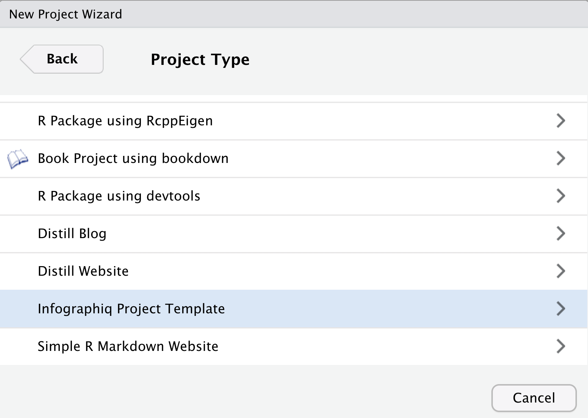
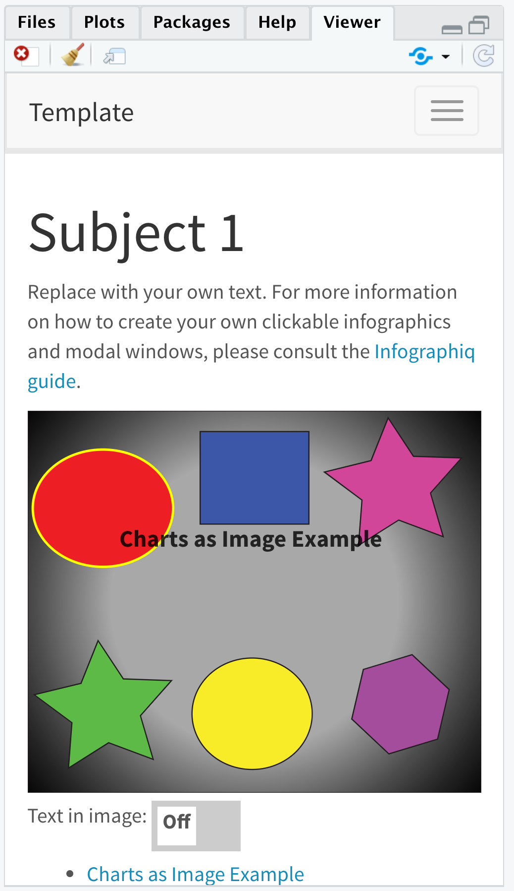
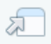
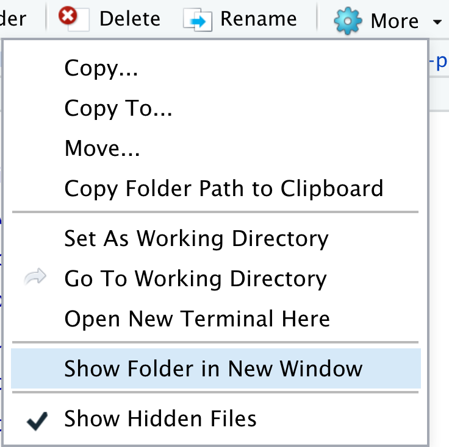
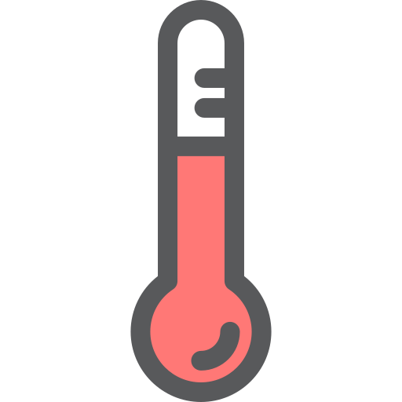

```{r, include=FALSE}
knitr::opts_chunk$set(echo = T, warning = F, message = F)

if (!require(librarian)){
  install.packages("librarian")
  library(librarian)
}
shelf(
  htmltools, mitchelloharawild/icons)
```

# Infographics

## Learning Objectives {.unnumbered .objectives}

Use a custom infographiq Javascript library to intelligently link icons of ecosystem elements to pop-up windows containing data figures, which could be static images or interactive visualizations.

## Install software

### InkScape

[**InkScape**](https://inkscape.org) is a design tool that is excellent at editing SVG files, which is also its native storage format. It is similar to [Adobe Illustrator](https://www.adobe.com/products/illustrator.html), except free. Please download it at [**inkscape.org/release**](https://inkscape.org/release).

(*The current version 1.1 for MacOS is 118 MB, so it may take some time to download depending on your connection speed.*)

### `infographiqR`

In order to use the infographiq template, you will need to install the following `infographiqR` R package:

```{r, eval=F}
remotes::install_github("marinebon/infographiqR")
```

Please close and restart all instances of RStudio before proceeding in order to load the `infographiqR` template project option.

## Create infographiq project

Please open **RStudio** by double-clicking on your `r3-exercises.Rproj` file to set your working directory. In the menu **File** -\> **New Project**..., **New Directory**, then **Infographiq Project Template**:

{width="500"}

If you don't see this option, then you presumably need to install `infographiqR` AND restart RStudio per the previous step.

Then: 1) specify a **directory** like `infographiq-project` inside your r3-exercises folder; and 2) tick **Open in a new session**; before clicking **Create Project**:

{width="500"}

RStudio should open to a new session with the **Source** and **Files** panes looking like so:

{width="500"}

### Notice Report techniques of `index.Rmd`

Do you notice two [Report](../report.html) techniques in `index.Rmd` that we discussed last week?

1.  **Parameters** `params` in the frontmatter to specify the infographic's two key inputs: 1) `svg` of the scalable vector graphic illustration; and 2) `csv` table matching the icon with the modal window content to open.

2.  **Child** chunk is used to render the `svg`. Open `_svg-html_child.Rmd` to see the parameters used inline with HTML code (which is valid markdown) to load the needed JavaScript then run the main [`infographiqJS`](https://marinebon.org/infographiqJS/) `link_svg()` function.

The combination of both techniques above allows multiple Rmds to use the same `_svg-html_child.Rmd` and specify different `params` for rendering different illustrations altogether.

### Knit the index

Knit the index. You should see in the **Viewer** pane the rendered document.

{width="400"}

The icons demonstrate different functionality...

### View with local web server

Within the top of the **Viewer** pane, you can normally click the icon **Show in new window** {width="29"} to open the knitted web page into a full browser window, but when you try this you'll get the unsatisfying result that the imagery disappears. This is because the reading of local files is not supported by `d3`'s `fetch()` function used to read the SVG, which is visible for instance if you open Google Chrome browser's View -\> Developer -\> JavaScript Console:

{width="600"}

Per the `d3` guru Mike Bostock in this [issue](https://github.com/d3/d3-fetch/issues/23#issuecomment-423691132), we need a web server to load these files in a standard browser. Thankfully we can easily do this with the `servr` package. Be sure to specify the same directory as where you created the `infographiq-project`, which if you are working from that project after ticking *Open in a new session* in previous step should be `"."`, i.e. the current working directory.

```{r, eval=F}
shelf(servr)     # load package; install if needed
getwd()          # check working directory
httd(dir = ".")  # run web server, aka http daemon

servr::httd()    # one-liner to run web server
```

RStudio should again open the `index.html` (i.e. the default web page for a folder) in your **Viewer** pane, but now you can click the icon **Show in new window** {width="29"} to see it correctly in a full size web browser. The locally served web address for me is `http://127.0.0.1:4321/` but might be different for you.

Open the files

## Link to a modal with image

Let's start editing this `infographiq` template website by replacing the red circle with a ***thermometer*** [***icon***]{.ul} and have it open a static figure of ***temperature*** [***indicator***]{.ul} over time as the indicator.

Start by opening a File Explorer (on Windows; or Finder on Mac) by going to RStudio's **File** pane and clicking the gear icon **More** -\> **Show Folder in New Window**:

{width="400"}

This should open File Explorer on Windows or Finder on Mac to your infographics. This may help you open files (try right-clicking to select the preferred application).

### Create modals/sst.`html`

Let's create a simple web page with an image using Rmarkdown by going to File -\> New File -\> Rmarkdown... . File -\> Save to `modals/sst.Rmd` and overwrite the entirety of the file with the following contents:

``` {.rmd}
---
pagetitle: "SST"
output: html_document
---

](https://raw.githubusercontent.com/NOAA-EDAB/ecodata/master/docs/LTL_MAB_files/figure-html/long-term-sst-1.png)
```

Knit this file to see the simple web page with an image. Next, let's add a suitable icon to the illustration and link the modal content with this page.

### Add temperature`.svg` icon

When I google "thermometer icon filetype:svg" and click Images (direct [link](https://www.google.com/search?tbm=isch&q=thermometer+icon&tbs=ift:svg)), I like the second [thermometer](https://www.svgrepo.com/svg/865/thermometer), which is usable under Creative Commons License, so please download this file. I save id to my `infographiq-project/icons/asdf`.

{width="100"}

Now open the `inkscape_example.svg` in Inkscape. (I right-clicked on the file and in Mac used the Open With menu.) Then delete the red circle. Then drag and drop the thermometer svg file onto the Inkscape Canvas. Use the

<https://marinebon.org/infographiq/image-creation.html#inkscape_XML>

## Link icon to modal with table (`.csv`)

Setup the `thermometer` to link to the `modals/sst.html` by swapping out icon = `chartexample4` with the following last line of this table:

+----------------------+---------------+--------------------------------------+----------------------------------+------------+-----------+
| svg                  | icon          | title                                | link                             | section    | not_modal |
+======================+===============+======================================+==================================+============+===========+
| inkscape_example.svg | chartexample1 | Google Charts Example                | modals/modal_google_charts.html  | Category 1 | F         |
+----------------------+---------------+--------------------------------------+----------------------------------+------------+-----------+
| inkscape_example.svg | chartexample2 | Google Charts Example with Trend Bar | modals/modal_google_charts2.html | Category 1 | F         |
+----------------------+---------------+--------------------------------------+----------------------------------+------------+-----------+
| inkscape_example.svg | chartexample3 | Highcharts Example                   | modals/modal_highcharts.html     | Category 1 | F         |
+----------------------+---------------+--------------------------------------+----------------------------------+------------+-----------+
| inkscape_example.svg | thermometer   | SST                                  | modals/sst.html                  | Category 2 | F         |
+----------------------+---------------+--------------------------------------+----------------------------------+------------+-----------+

## Further Resources {.unnumbered}

-   [Infographiq guide](https://marinebon.org/infographiq/): online manual
-   [Infographiq manuscript](https://drive.google.com/file/d/1qLmY0CWC0PDnRL7Y9Ks3hYU86p4tYoJZ/view?usp=sharing): aka "Webenized Condition Report", submitted to NOAA Sanctuary [Conservation Series](https://sanctuaries.noaa.gov/science/conservation/welcome.html) on 2021-07-09
