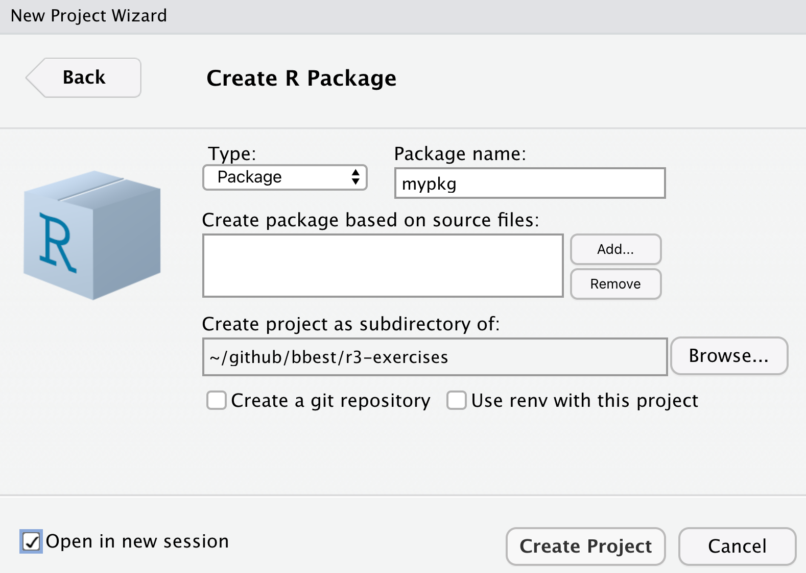

```{r, include=FALSE}
knitr::opts_chunk$set(echo = T, warning = F, message = F, eval=F)

if (!require(librarian)){
  install.packages("librarian")
  library(librarian)
}
shelf(
  htmltools, mitchelloharawild/icons)
```

# Applications

## Learning Objectives {.unnumbered .objectives}

An R package is a documented set of functions that can act as building blocks for data ingestion, analysis, visualization and reporting. We'll go over the basics of creating an R package and documenting functions within.

## Install R packages

Ensure you have the R packages used to help build R packages.

```{r}
librarian::shelf(
  devtools, pkgdown, roxygen2, usethis)

```

## Create your first R package web app

Similar to other examples, let's create a simple R package from within your ***r3-exercises*** RStudio project starting from the provided default by going to **File** -\> **New Project...** -\> **New Directory** -\> **R Package**... and name it ***mypkg***.

{width="400"}

By ticking **Open in a new session** before Create Project, another instance of RStudio will open in addition to your existing one (i.e. the ***r3-exercises*** project).

Notice the file structure in your RStudio **Files** pane:

-   **DESCRIPTION**\
    name, author, version, package dependencies

-   **NAMESPACE**\
    functions to import and export

-   **R/**\
    folder containing R files

    -   **hello.R**\
        specific functions defined in R files

-   **man/**\
    folder containing manual files with documentation

    -   **hello.Rd**\
        documentation in Latex style\
        (which gets auto-generated by inline R comments with roxygen2)

Open each file to get a sense of its contents and style of tet.

## Load the Package {.unnumbered}

Before you can use the single `hello()` function in this package, you'll need to load it first. There are a few options for how to load this, which is summarized in the [Package Development with devtools Cheatsheet](https://github.com/rstudio/cheatsheets/raw/master/package-development.pdf):

{width="500"}

Although a daunting diagram at first blush, it's very informative with the different pathways to going from source code to functions in the package being loaded into memory and available. Let's start with the most direct path from **Source** to **In memory** within your ***mypkg*** RStudio instance, which is what you most commonly use as you develop an R package:

```{r}
devtools::load_all()
```

Looking at the help (`?devtools::load_all`), we see the first argument is the path which defaults to your current working directory (`"."`; see with `getwd()`). Now test it out:

```{r}
# run function
hello()

# look at the help documentation for the function
?hello
```

## Document functions in R/

The original R format for documentation `*.Rd` is in Latex format that has a lot of extra syntax and is also easy to mismatch the function's arguments and logic as it gets developed in a separate `*.R` file. Entrez `roxygen2` to the rescue (that is run with `devtools::document()`), which allows you to easily document the function directly above its R definition with special commenting.

Open the R/hello.R file, place your cursor inside the `hello()` function and go to RStudio's menu **Code** -\> **Insert Roxygen Skeleton**. You should see the new special comments populate above the function:

```{r}
#' Title
#'
#' @return
#' @export
#'
#' @examples
hello <- function() {
  print("Hello, world!")
}
```

To mimic the original documentation, replace the defaults to look like so:

```{r}
#' Hello, World!
#'
#' Prints 'Hello, World!'
#'
#' @return a string
#' @export
#'
#' @examples
#' hello()
hello <- function() {
  print("Hello, world!")
}
```

Now to update the documentation using `roxygen2`, you'll need to first ***delete*** these files which will hereafter be written only by `roxygen2`:

-   NAMESPACE

-   man/hello.Rd

```{r}
# document functions in the package
devtools::document()
# ℹ Updating mypkg documentation
# First time using roxygen2. Upgrading automatically...
# ℹ Loading mypkg
# Writing NAMESPACE
# Writing hello.Rd
```

Now reload the package and look at the help:

```{r}
# reload the function
devtools::load_all()

# look at the help documentation for the function
?hello
```

### Add argument

Next, let's add an argument to make the function flexible to greet anyone:

```{r}
#' Hello, World!
#'
#' Prints 'Hello, {name}!'
#'
#' @param name who to greet; defaults to "World"
#'
#' @return a string
#' @export
#'
#' @examples
#' hello()
#' hello("Ben")
hello <- function(name = "World") {
  print(glue::glue("Hello, {name}!"))
}
```

To get above, we:

-   Added `name` as an argument to the function with the default value of `"World"`.

-   Constructed the string with the `glue::glue()` function to use the argument.

-   Ran **Code** -\> **Insert Roxygen Skeleton** again to detect the new argument in the function and add the special `roxygen2` comment with `@param name`.

### Add dependency

You'll notice that we're now using the package `glue` and its core function `glue`, but we haven't declared that within the dependencies of the package. To do so you'll want to add the following line (such as above `@export` line):

```{r}
#' @importFrom glue glue

```

This imports the function glue from the package glue. To simply import the entire package for use with this function you could have alternatively used:

```{r}
#' @import glue

```

As always, to then update the documentation:

```{r}
devtools::document()
```

Note the new line added to the NAMESPACE file:

`importFrom(glue,glue)`

If you want to ensure the dependent package gets installed when yours is installed, then run the following in the R console:

```{r}
usethis::use_package("glue")
# ✓ Setting active project to '/Users/bbest/github/bbest/r3-exercises/mypkg'
# ✓ Adding 'glue' to Imports field in DESCRIPTION
# • Refer to functions with `glue::fun()`
```

Note that this command updates the `DESCRIPTION` file with the following to alert that installation of the `glue` package is also needed:

```{yaml}
Imports: 
    glue
```

For more detailed nuances, check out [Connecting to other packages](https://kbroman.org/pkg_primer/pages/depends.html).

## Add data

Besides functions, you can also make data available in your R package. This is especially helpful for lookup tables and sample datasets to be used as examples to run your functions.

Let's setup the reproducible code to create our dataset in a special folder data-raw:

```{r}
usethis::use_data_raw()
# ✓ Creating 'data-raw/'
# ✓ Adding '^data-raw$' to '.Rbuildignore'
# ✓ Writing 'data-raw/DATASET.R'
# • Modify 'data-raw/DATASET.R'
# • Finish the data preparation script in 'data-raw/DATASET.R'
# • Use `usethis::use_data()` to add prepared data to package

```

Let's open the newly `created data-raw/DATASET.R` and add a test dataset by replacing its contents with the following:

```{r}
# create data object, such as a dataframe of exponential growth
df_exp <- data.frame(
  x = 1:10,
  y = (1:10)^2)

# store object in data/*.rda
usethis::use_data(df_exp, overwrite = TRUE)
```

Now **Source** this file. You should see:

`✓ Saving 'df_exp' to 'data/df_exp.rda' • Document your data (see 'https://r-pkgs.org/data.html')`

Borrowing from [14.1.1 Documenting datasets \| R Packages](https://r-pkgs.org/data.html#documenting-data), let's create a **File** -\> **New File** -\> **R Script** and save it in `R/data.R`.

```{r}
#' Data frame of exponential data
#'
#' A simple data frame of y ~ x^2
#'
#' @format A data frame with 10 rows and 2 variables:
#' \describe{
#'   \item{x}{1 to 10}
#'   \item{y}{(1 to 10)^2}
#'   ...
#' }
#' @source \url{https://noaa-iea.github.io/r3-train/packages.html}
"df_exp"

```

Finally, update the documentation:

```{r}
# update documentation
devtools::document()
```

And test it out:

```{r}
# reload the package
devtools::load_all()

# show dataset
df_exp

# get dataset documentation
?df_exp
```

## Add vignette

Help documentation is good for documenting individual functions, but what if you want to show how functions interact or interactive visualizations. This is the role of vignettes, which are standalone documents to explain how functions interact and perhaps different case studies for using the R package.

Let's start by using a special name for the vignette of the package name `"mypkg"` (so that later it will be published on the website with a Getting Started link).

```{r}
usethis::use_vignette("mypkg")
# ✓ Adding 'knitr' to Suggests field in DESCRIPTION
# ✓ Setting VignetteBuilder field in DESCRIPTION to 'knitr'
# ✓ Adding 'inst/doc' to '.gitignore'
# ✓ Creating 'vignettes/'
# ✓ Adding '*.html', '*.R' to 'vignettes/.gitignore'
# ✓ Adding 'rmarkdown' to Suggests field in DESCRIPTION
# ✓ Writing 'vignettes/mypkg.Rmd'
# • Modify 'vignettes/mypkg.Rmd'
```

### Add plotting function

Before we get further into the vignette let's create a function that shows an interactive plot so we can demonstrate something a bit more interesting by going to **File** -\> **New File** -\> **R Script** and save it in `R/plot.R`.

```{r}
ts_plot <- function(d){
  dygraphs::dygraph(d) %>%
    dygraphs::dyRangeSelector()
}
```

Next run **Code** -\> **Insert Roxygen Skeleton** and replace with the following:

```{r}
#' Time series plot
#'
#' Plot time series interactively.
#'
#' @param d data frame with two columns
#'
#' @return interactive dygraph plot
#' @import dygraphs
#' @export
#'
#' @examples
#' ts_plot(df_exp)
```

Note that we're using the example dataset we previously created in the example and added the explicit `@import dygraphs`. To require the `dygraphs` R package to be installed let's also run:

```{r}
usethis::use_package("dygraphs")
```

We're also using the pipe operator `%>%` and there's a special way to import that:

```{r}
# import pipe operator %>%
usethis::use_pipe()
# ✓ Adding 'magrittr' to Imports field in DESCRIPTION
# ✓ Writing 'R/utils-pipe.R'
# • Run `devtools::document()` to update 'NAMESPACE'

# update documentation
devtools::document()
```

### Finish vignette

Let's add the following to your `vignettes/mypkg.Rmd`:

````

## Hello

This is my first package. Let's start with hello.

```{r}`r ''`
person <- "Hadley"
hello(person)
```

## Data

We loaded this data:

```{r}`r ''`
df_exp
```

## Plot

And created this plotting function:

```{r}`r ''`
ts_plot(df_exp)
```
````

Before you can Knit this vignette you'll need to install the package locally so `library(mypkg)` can work from the `setup` R chunk:

```{r}
devtools::install()
```

Now you can **Knit** the vignette. But to install the whole package with the vignette you'll need to run:

```{r}
devtools::install(build_vignettes = T)
```

Now you can test the end user experience:

```{r}
library(mypkg)

vignette("mypkg")
```

## Build website

Next, let's build a website for your R package:

```{r}
pkgdown::build_site()
# -- Installing package into temporary library ----------------------------------------
# == Building pkgdown site =======================================================
# Reading from: '/Users/bbest/github/bbest/r3-exercises/mypkg'
# Writing to:   '/Users/bbest/github/bbest/r3-exercises/mypkg/docs'
# -- Initialising site -----------------------------------------------------------
# Copying '../../../../../../Library/Frameworks/R.framework/Versions/4.1/Resources/library/pkgdown/assets/bootstrap-toc.css' to 'bootstrap-toc.css'
# Copying '../../../../../../Library/Frameworks/R.framework/Versions/4.1/Resources/library/pkgdown/assets/bootstrap-toc.js' to 'bootstrap-toc.js'
# Copying '../../../../../../Library/Frameworks/R.framework/Versions/4.1/Resources/library/pkgdown/assets/docsearch.css' to 'docsearch.css'
# Copying '../../../../../../Library/Frameworks/R.framework/Versions/4.1/Resources/library/pkgdown/assets/docsearch.js' to 'docsearch.js'
# Copying '../../../../../../Library/Frameworks/R.framework/Versions/4.1/Resources/library/pkgdown/assets/link.svg' to 'link.svg'
# Copying '../../../../../../Library/Frameworks/R.framework/Versions/4.1/Resources/library/pkgdown/assets/pkgdown.css' to 'pkgdown.css'
# Copying '../../../../../../Library/Frameworks/R.framework/Versions/4.1/Resources/library/pkgdown/assets/pkgdown.js' to 'pkgdown.js'
# Writing '404.html'
# -- Building home ---------------------------------------------------------------
# Writing 'authors.html'
# -- Building function reference -------------------------------------------------
# Writing 'reference/index.html'
# Reading 'man/df_exp.Rd'
# Writing 'reference/df_exp.html'
# Reading 'man/hello.Rd'
# Writing 'reference/hello.html'
# Reading 'man/pipe.Rd'
# Writing 'reference/pipe.html'
# Reading 'man/ts_plot.Rd'
# Writing 'reference/ts_plot.html'
# -- Building articles -----------------------------------------------------------
# Writing 'articles/index.html'
# Reading 'vignettes/mypkg.Rmd'
# Writing 'articles/mypkg.html'
# == DONE ========================================================================
# -- Previewing site ------------------------------------------------------------------
```

Note how the website is populated into the `docs/` folder. The home page (`docs/index.html`) is quite plain, so let's add the README to populate that:

```{r}
usethis::use_readme_rmd()
# ✓ Setting active project to '/Users/bbest/github/bbest/r3-exercises/mypkg'
# ✓ Writing 'README.Rmd'
# ✓ Adding '^README\\.Rmd$' to '.Rbuildignore'
# • Modify 'README.Rmd'
# ✓ Creating '.git/hooks/'
# ✓ Writing '.git/hooks/pre-commit'
```

You should update the `install_github` line according to your Github `USER` name (e.g. ***`bbest`*** for me) and indicate the package is in a subdirectory.

```{r}
remotes::install_github("USER/r3-exercises", subdir="mypkg")
```

Now push the website to Github for sharing with the world by going to your ***r3-exercises*** RStudio project and in the **Git** pane **Commit** the new `mypkg` folder and **Push** to Github. You should then see the documentation at your `USER` r3-exercises website:

`https://USER.github.io/r3-exercises/mypkg/docs`

## Further Resources {.unnumbered}

-   [Package Development with devtools cheatsheet](https://github.com/rstudio/cheatsheets/raw/master/package-development.pdf)
-   [R Packages book](https://r-pkgs.org/)
-   [R package primer](https://kbroman.org/pkg_primer/)\
